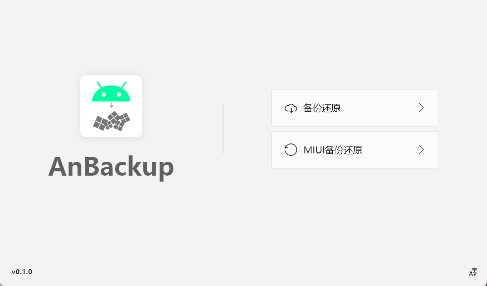

## 前言

这一年感觉啥都没干好，但仔细回想起来，虽然没有哪件事情达到了预期的目标，但每一次的尝试和挑战都让我学到了宝贵的经验。不管是登山时意外的遭遇，还是比赛中的失利，甚至是开发过程中的种种挫折，都是我前进路上的一部分。也许我没有在某个领域取得突破性的进展，但我在内心深处种下了成长的种子。面对即将过去的一年，我有太多的不甘心和遗憾，但正是这些情感，让我对未来抱有更加强烈的欲望（AI）

## 生活

在 6 月份去了武功山，当时因为看到别人拍的视频照片吸引过去的听说，过程非常的辛苦，最后上去后也没看到啥日出，还一堆人，满地的垃圾。回来后全身酸痛，以后不当特种兵了（呜呜呜

在 10 月份的时候咱爸生日来我这里去了世界之窗还有橘子洲头玩（走的累死了）,在世界之窗就是去玩了一个海盗船，因为咱爸玩了海盗船后就特别想吐了后面就没玩啥了((

## 竞赛

之前说的要通过竞赛升本已经泡汤了，当时比赛时的设备差，很多人的设备都一直死机。一开始的时候项目没运行起来（一定要放到桌面才能运行），有个技术人员还一直在说我们没实力就别来参加比赛（他们一开始也没说一定要放到桌面才能运行），那个人一直在说，说的巨烦...。已经知道社会的险恶了。能拿一等的都是有关系的（我们这只有一等才能免笔试）。

我不会再去参加什么竞赛了，水太深了除非我们学校是主办方我才会去参加。

## 开源

### [miru-app](https://github.com/miru-project/miru-app)

用 Flutter 写了 Miru 的客户端，从 6 月 30 号创建仓库开始到现在 8 个月已经有 1k star 了非常高兴，但其实代码还是很烂我在想重构但是有点太懒了，原本计划要在学校把 web 版本写出来但各种原因导致没写。

### [Wallpaper](https://github.com/MiaoMint/wallpaper)

一个简单的壁纸站点，可以批量下载啥的，目前还有一些小 BUG 一直没修（这人怎么这么懒

### [Anbackup](https://github.com/MiaoMint/anbackup)

能将 Android 手机数据直接备份到电脑的工具，MIUI 的备份包还原咕了（，这个备份速度很慢。因为是一个一个文件传的如果能多线程也许就可以很快了

### [gongde](https://github.com/MiaoMint/gongde)

之前 gongde.me 的域名是白嫖的一年，因为过期了所以做成了浏览器扩展，上架了 [Edge 的扩展商店](https://microsoftedge.microsoft.com/addons/detail/%E5%8A%9F%E5%BE%B7/aheijdaadmgimhjbggcidfpcjjlgbgnl)

还有一些小玩意可以在我的 [Github](https://github.com/MiaoMint) 找到

## 技术成长

可能稍微学习了 Flutter ，所以顺便学习了 Dart? 可能吧

玩了下 Astro 什么的。

## 各平台年度总结

### Youtube Music

### Bilibili

### Github

## 2024 年规划

- 过下英语四级
- 找个实习的工作
- 完成 Miru web 版本
- 完善还有一些之前挖过的坑

~~(这篇文章的封面是用我自己照片生成的，欸嘿)~~